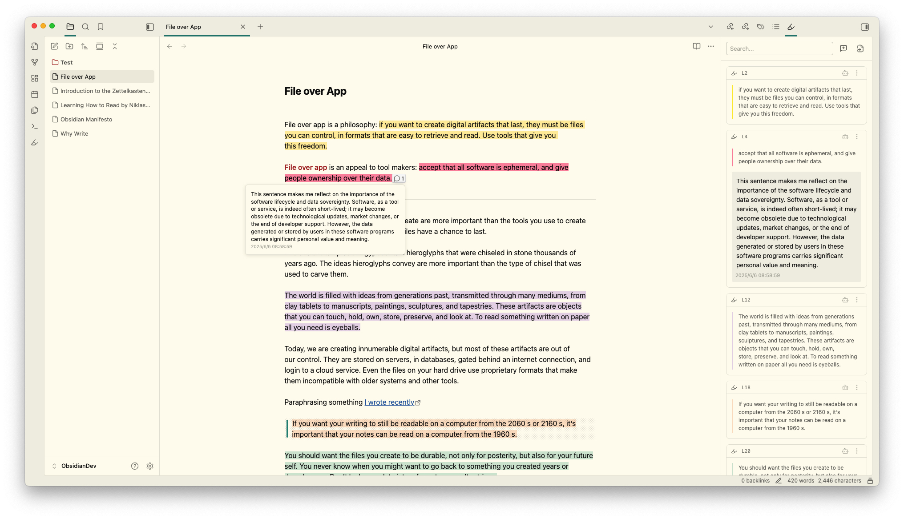
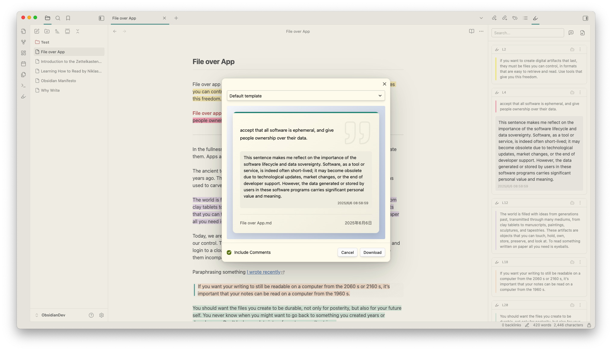
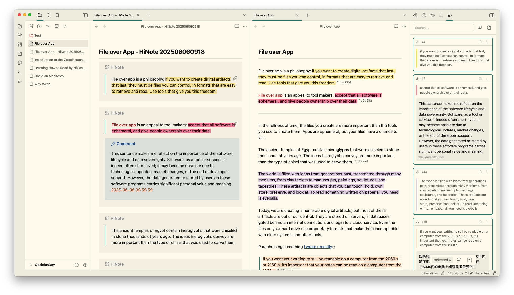
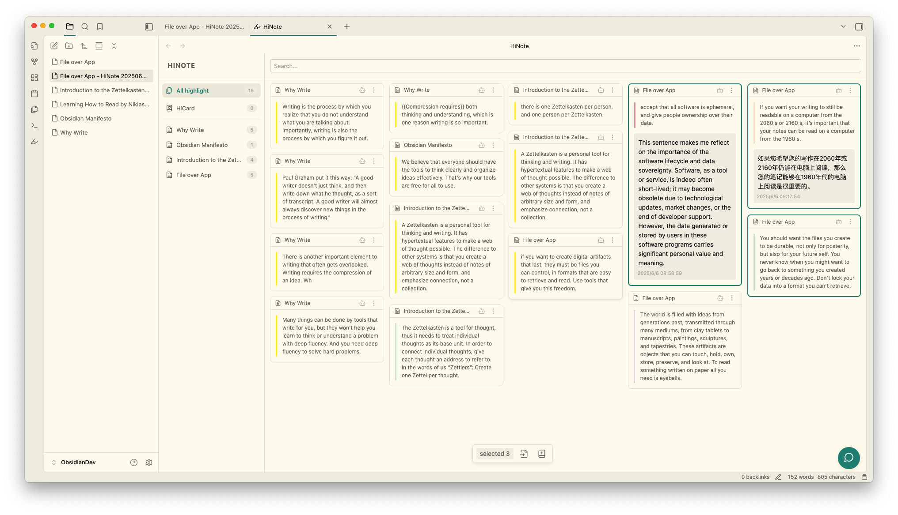
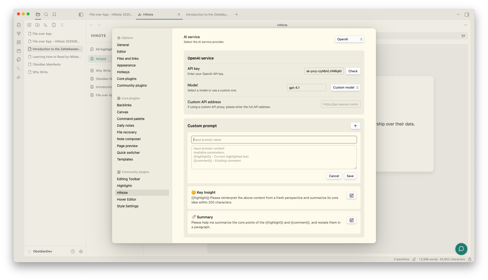
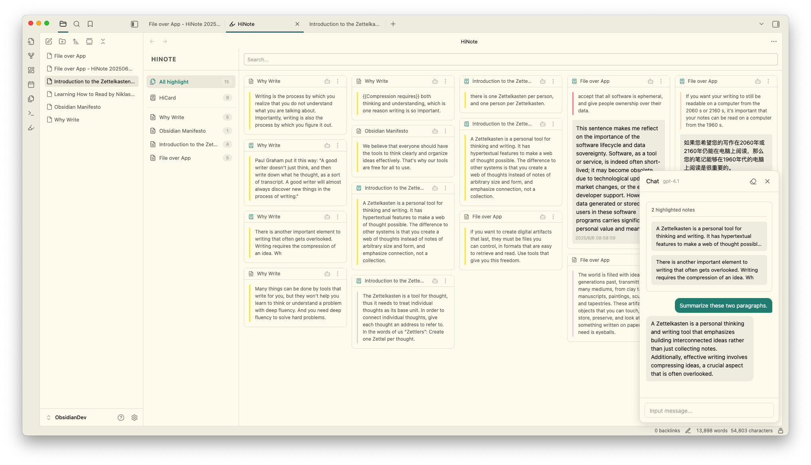
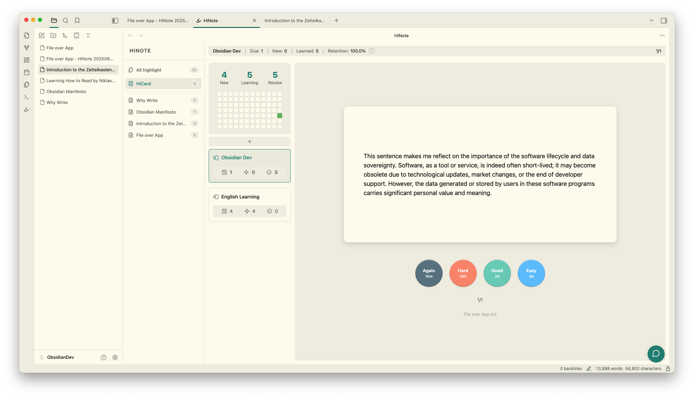
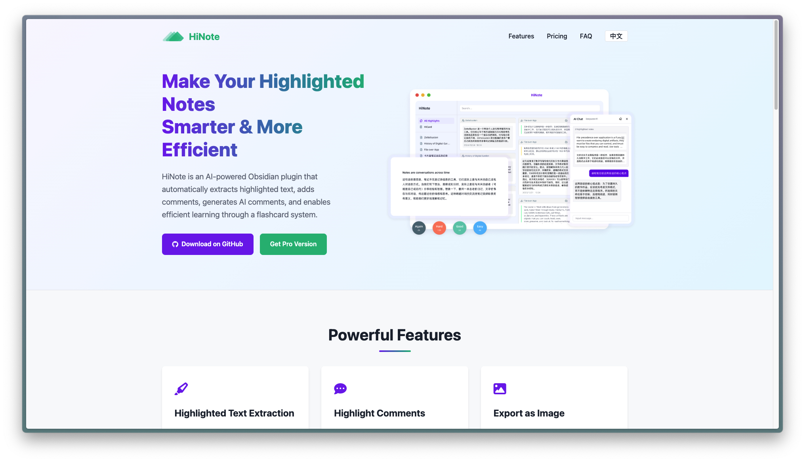

	<h1>HiNote-高亮文本添加评论</h1>
	
	
	
	
	

---

简体中文 | [English](./README.md)

这款由 AI 编程的 Obsidian 插件能够自动提取笔记中的高亮文本，支持用户添加评论、生成 AI 评论及与高亮文本进行对话。用户可以使用多种格式进行文本高亮，并将其导出为知识卡片图片或全新笔记，同时在主视图中享受更多扩展功能。

>  我完全没有研发经验，这款插件是我和 AI 共同完成，作为 Beta 版请谨慎使用。

👇🏻 点击图片查看视频教程

---
## 高亮文本获取

当打开包含高亮文本的笔记时，侧边栏会自动获取高亮文本以卡片的样式展示。支持以下三种格式的高亮标记：`==` 、`<mark> `、``。同时支持通过正则表达式来自定义获取格式。

---
## 高亮评论

高亮评论功能让您能够快速与高亮文本进行对话，防止灵感稍纵即逝。只需点击编辑区的 Widgets 或直接在卡片上点击添加评论按钮，即可打开评论输入框。

笔记评论功能让你可以不依赖于任何高亮文本为整个文件添加你的思考。点击搜索栏右侧添加文件评论即可在高亮列表最顶部打开输入框。

>  所有高亮和评论数据都会保存在插件的 `data.json` 文件中，完全由您自行掌控。

---

## 导出为图片

导出你的高亮文本和评论，创建设计精美的知识卡片，便于分享。

---

## 导出为笔记

将你的全部高亮文本和评论导出为一篇新的笔记，笔记采用 Callout 格式展示，并且每一个高亮和评论都可以通过块引用（Block ID）关联到源笔记。

---

## 主视图的扩展功能

将右侧侧边栏窗口拖动到主视图，可以解锁更多功能，例如：包含高亮文本的笔记列表、所有高亮卡片以及 AI 对话窗口（详见后文）。

- 笔记列表：显示知识库中所有包含高亮文本的笔记，并标注高亮数量;
- 全部高亮：展示知识库中所有高亮卡片，让你更专注地查看高亮知识;
- AI 对话：可以通过右下角对话图标打开 AI 对话窗口（详见后文）;
- HiCard：实现了将你的高亮文本和评论生成 FlashCard 功能，辅助你记忆学习（Pro 功能）;

---

## AI 评论

AI 可以辅助你进行思考，并将生成的内容以评论的形式添加到高亮文本的下方。首先，你需要在插件的设置菜单中配置 AI 服务商、API Key 和模型。目前支持的服务商包括 OpenAI、Gemini、Anthropic、Deepseek、SiliconFlow 和 Ollama。

接下来，配置你自定义的 Prompt。在这里，你可以使用两个字段来获取高亮文本和评论内容： `{{highlight}}` 和 `{{Comment}}` 。

最后，你就可以在高亮卡片的 AI 按钮中使用你自定义的 Prompt 了。

---

## AI  对话

在主视图的右下角，你可以点击对话图标，或使用快捷命令（`Ctrl/Cmd+P`）打开 AI 对话窗口。该窗口可以自由拖动和调整大小。在对话窗口中，您可以切换 AI 服务的模型，支持清空当前对话内容（请注意，清空后无法恢复，且目前不支持导出和保存）。

此外，您还可以将高亮的卡片拖入对话窗口，作为对话的一部分，并支持同时拖入多条高亮内容。

## Pro功能

HiNote 提供额外的付费高级功能，以增强您的笔记和学习的体验：

### 闪卡系统

HiNote 的专业版中提供了闪卡功能。这个高级的间隔重复系统帮助您更有效地记忆您的高亮内容：

- 只需一键将您的突出内容转换为闪卡
- 利用 FSRS（间隔重复调度器）算法以实现最佳学习效率
- 自定义复习计划以适应您的学习风格

要访问这些高级功能，您需要 [获取许可证](https://hinote.vip)。

---

## 许可证

此插件采用 MIT 许可证发布。基本功能是免费和开源的，而一些高级功能需要专业许可证。