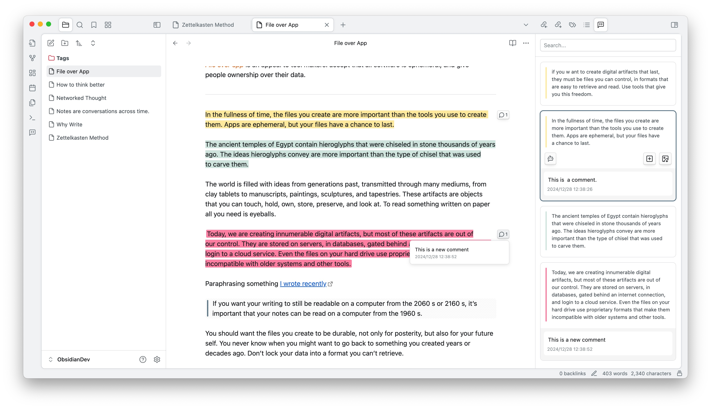
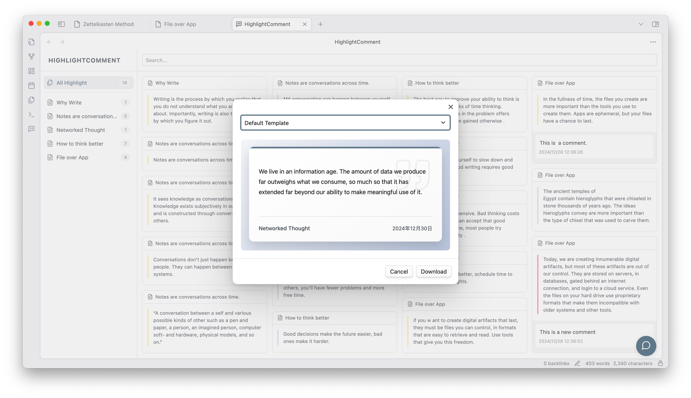
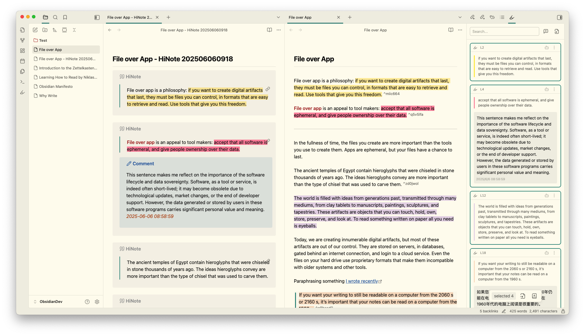
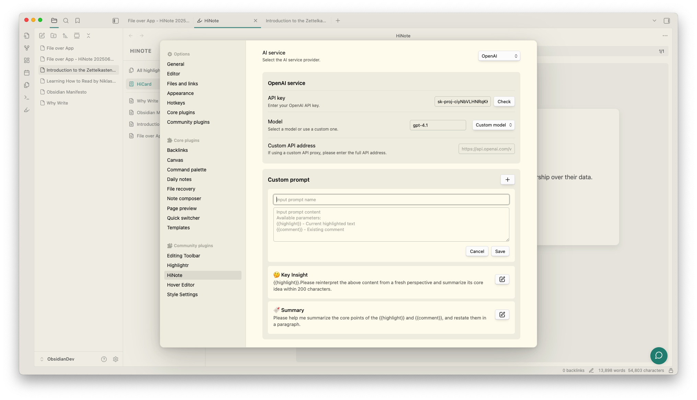
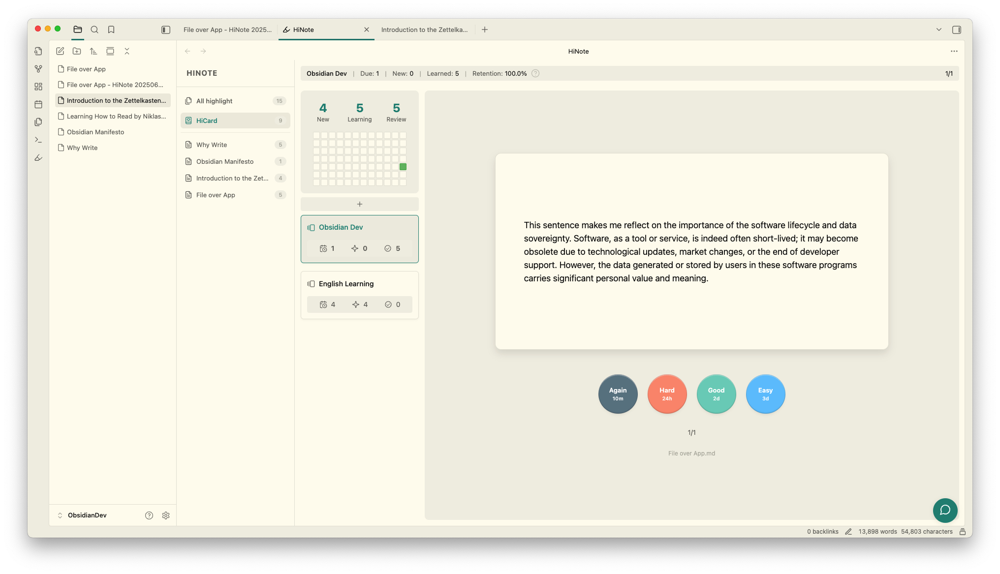
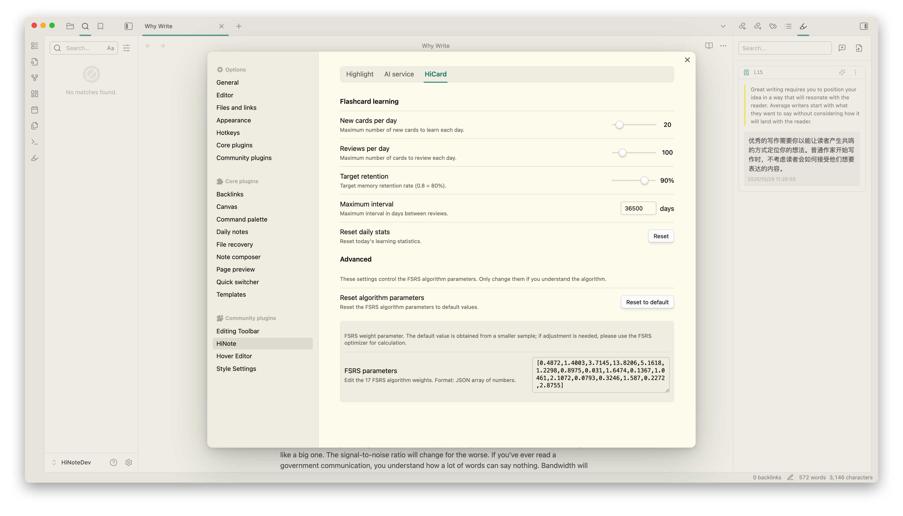
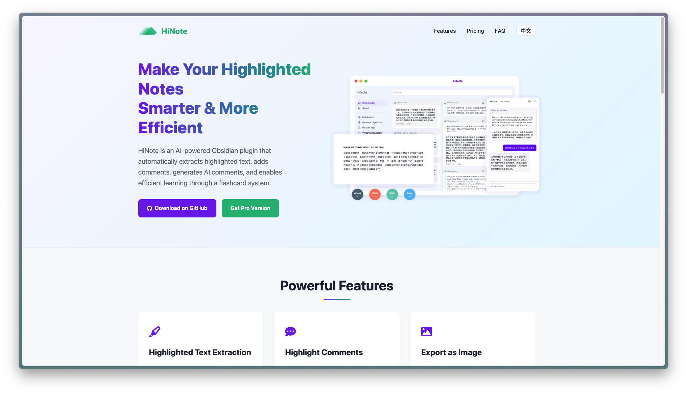

	<h1>HiNote - 高亮文本添加评论</h1>
	
	
	
	
	

需要 Obsidian 1.13.0 或更高版本，支持 Obsidian 设置搜索。

---

简体中文 | [English](./README.md)

这款由 AI 编程的 Obsidian 插件能够自动提取笔记中的高亮文本，支持用户添加评论、生成 AI 评论及与高亮文本进行对话。用户可以使用多种格式进行文本高亮，并将其导出为知识卡片图片或全新笔记，同时在主视图中享受更多扩展功能。

>  本插件由 AI 辅助开发，目前处于 Beta 测试阶段，建议谨慎使用并及时备份数据。

👇🏻 点击图片查看视频教程

---

## ✨ 核心特性

🎯 自动提取多种格式的高亮文本 | 📝 为高亮添加评论和笔记 | 🤖 AI 辅助评论和智能对话 | 📸 导出为精美知识卡片 | 📝 生成关联源笔记的新笔记 | 🧠 间隔重复学习系统（Pro）

> 💡[升级到 Pro 版](https://hinote.vip) 可解锁基于 FSRS 算法的闪卡系统，高效记忆你的高亮内容

---

## 高亮文本获取

当打开包含高亮文本的笔记时，侧边栏会自动获取高亮文本以卡片的样式展示。支持以下三种格式的高亮标记：`==`、`<mark>`、``。同时支持设置正则表达式来自定义获取格式。

支持 Obsidian 1.14 彩色高亮，例如 `==🔴重要内容==`。在开头的 `==` 后紧接红、橙、黄、绿、蓝、紫色圆点或对应方块，卡片色条会使用对应的主题颜色；卡片正文和导出的引用不包含格式色标。更改颜色会保留关联评论。官方编辑器选色功能需要 Obsidian 1.14，HiNote 本身仍兼容 Obsidian 1.13。

---

排除规则按实际文件后缀匹配：例如显示为 `HiNote.xcd` 的笔记，如果实际文件名为 `HiNote.xcd.md`，请填写 `*.xcd.md`。保存规则后会自动更新高亮索引、主视图列表和搜索结果，无需重载插件；移除规则后可重新显示文件，已有评论不会被删除。

## 高亮评论

高亮评论功能让你能够快速与高亮文本进行对话，防止灵感稍纵即逝。只需点击编辑区的 Widgets 或直接在选中的高亮卡片上点击添加评论按钮，即可打开评论输入框。

笔记评论功能让你可以不依赖于任何高亮文本为整个文件添加你的思考。点击搜索栏右侧添加文件评论即可在高亮列表最顶部打开评论输入框。

>  所有评论和高亮数据都会保存在你自己知识库根目录的 `.hinote` 文件夹中，数据完全由你自行掌控。

---

## 导出为图片

导出你的高亮文本和评论，创建设计精美的知识卡片，便于分享。

---

## 导出为笔记

将你的全部高亮文本和评论导出为一篇新的笔记，笔记采用 Callout 格式展示，并且每一个高亮和评论都可以通过块引用（Block ID）关联到源笔记（需在设置菜单配置包含 highlightBlockRef 的导出模板）。

---

## 主视图的扩展功能

通过命令 **在主窗口打开**，或将右侧侧边栏窗口拖动到主视图，可浏览笔记列表、全部高亮以及 HiCard。点击文件列表顶部的 **HINOTE** 标题可刷新列表和当前内容。

搜索和页面选择分别保存，清空全局搜索会回到选中的笔记范围。切换笔记或 HiCard 时，未保存的评论草稿保留在当前视图会话中，再次打开对应评论输入框可继续编辑；草稿不跨插件重载或应用重启保存。

- 笔记列表：显示知识库中所有包含高亮卡片的笔记，并显示高亮数量;
- 全部高亮：展示知识库中所有高亮卡片，让你更专注地查看高亮知识;
- HiCard：实现了将你的高亮文本和评论生成 FlashCard 功能，辅助你记忆学习（Pro 功能）

---

## AI 评论

AI 可以有效辅助你进行思考，并将生成的内容以评论的形式添加到高亮卡片中。

首先，你需要在插件的设置菜单中配置 AI 服务商、API Key 和模型。目前支持的服务商包括 OpenAI、Gemini、Anthropic、Deepseek、SiliconFlow 和 Ollama。

接下来，配置你自定义的 Prompt。在这里，你可以使用两个字段来获取高亮文本和评论内容：`{{highlight}}` 和 `{{comment}}`。

最后，你可以在高亮卡片右上角的 AI 按钮中使用你自定义的 Prompt 了。或者在批注的输入框中输入任意自定义的 Prompt 后，直接点击 Tab 键来触发 AI 服务。

---

## Pro 功能

HiNote 提供额外的付费高级功能，以增强你的笔记和学习体验：

### 闪卡系统

HiNote 的专业版中提供了闪卡功能。这个高级的间隔重复系统帮助你更有效地记忆你的高亮内容：

- 只需一键将你的高亮内容转换为闪卡
- 利用 FSRS（间隔重复调度器）算法以实现最佳学习效率
- 自定义复习计划以适应你的学习风格

要访问这些高级功能，你需要 [立即升级到 Pro 版](https://hinote.vip)。

---

## 支持

如果你觉得这个插件很有用，你也可以支持插件的开发：

- [在 Ko-fi 上买我一杯咖啡](https://ko-fi.com/catmuse)
- 给项目点个 ⭐ 星，以表达你的支持！

---

## 许可证

此插件采用 MIT 许可证发布。基本功能是免费和开源的，而一些高级功能需要专业许可证。

## 本地数据保护

已有 `.hinote` 映射继续兼容。新增高亮记录使用独立存储标识，笔记重命名时保留原数据文件。覆盖已有高亮、闪卡或映射文件前，会将上一份内容保存在同目录的 `.bak` 文件中；它只保留上一个版本，不能替代笔记库备份。

读取失败或数据格式损坏时，会停止相关操作，不会用空库替换旧数据。如果旧映射中多篇笔记指向同一个文件，或映射丢失后无法明确恢复归属，请先从笔记库备份恢复映射及数据，再继续编辑。插件不会猜测归属或自动合并冲突记录。

高亮关联优先使用唯一文本、已有块信息和上下文，并在整篇笔记中保持一对一关系。重复文本不会仅凭最近位置关联评论；无法确定归属时，原评论和闪卡会保留，但暂时不会挂到某条高亮上。设置中的 **检查高亮关联** 只报告未定位记录和跳过的文件，不再自动清理这些数据。暂不提供人工重新关联入口。

定位更新仅合并最新记录的定位字段，不覆盖评论或修改其时间。复杂上下文匹配有计算上限，超出上限时保留未定位状态；不需要迁移现有 ID，也不会为此修改笔记正文。

扫描高亮只生成临时卡片标识；首次保存评论或创建闪卡时才分配独立的永久 ID。旧记录及闪卡来源 ID 保持不变，`.hinote` 继续使用原有 v2 格式，无需迁移。扫描、存储和界面数据的边界见 [高亮数据模型](./doc/highlight-data-model.md)。

## API 密钥与 Keychain

AI 服务使用 Obsidian Keychain。请在 HiNote 的 AI 服务设置中选择或创建密钥；插件设置仅保存密钥名称。每台设备需要单独配置对应密钥。HiNote 在开始 AI 操作时读取密钥，在 Keychain 中的修改会应用于后续请求。

升级至 0.5.9 **不会自动迁移旧密钥**。首次加载时会移除插件设置中的旧 API key 字段，请在升级前保留需要的密钥，并重新配置 Keychain。历史备份与同步历史不会被修改。无需身份验证的 Ollama 不需要配置密钥。

AI 模型可直接输入 ID，也可点击 **刷新模型** 后搜索选择；打开设置不会自动拉取模型。自定义服务需要明确选择 API 协议。**测试当前模型** 会发送不含笔记内容的简短请求，可能产生服务商费用。请求在 45 秒后停止等待，但服务端仍可能继续完成请求。

## 收藏高亮

选择高亮卡片上的星标即可收藏。在主视图中，通过“全部高亮”下方的“收藏”入口统一查看，默认按最近收藏排序。收藏页的搜索（含搜索前缀）仅作用于收藏内容。多选卡片后，可批量收藏；全部选中项都已收藏时，工具栏提供批量取消收藏。

收藏与原高亮共用内容、批注和闪卡。取消收藏不会删除这些内容，也不会弹出提示。收藏状态保存在仓库的 `.hinote` 文件夹内，删除最后一条批注或闪卡也会保留收藏。原文暂时无法定位时，会显示已保存的内容和提示；被排除的笔记会隐藏，解除排除后恢复。

侧边栏点击高亮正文时，会滚动到笔记中的对应内容并短暂显示半透明主题主色背景，不再选中文字、移动光标或抢占编辑器焦点。实时预览和阅读模式均保持原有模式；定位提示遵循系统的减少动态效果设置。
