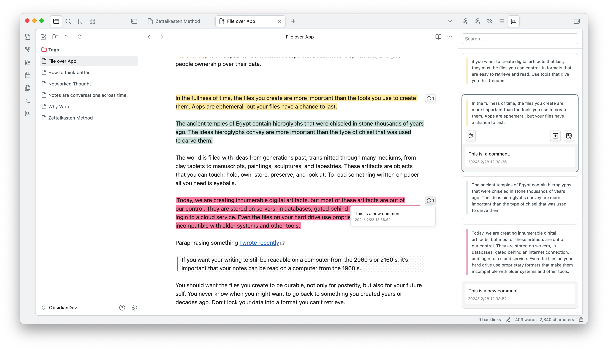
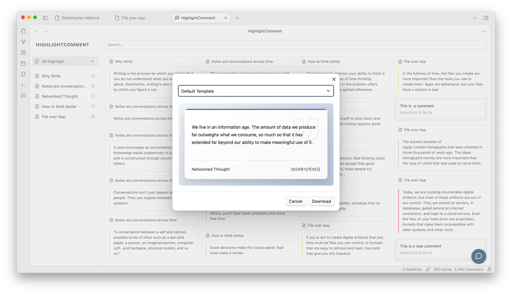
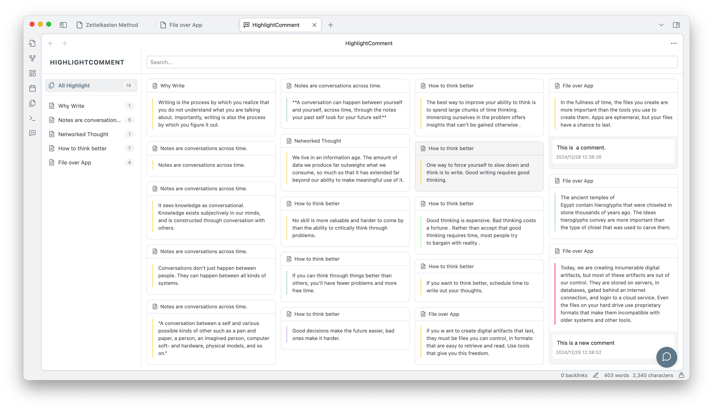
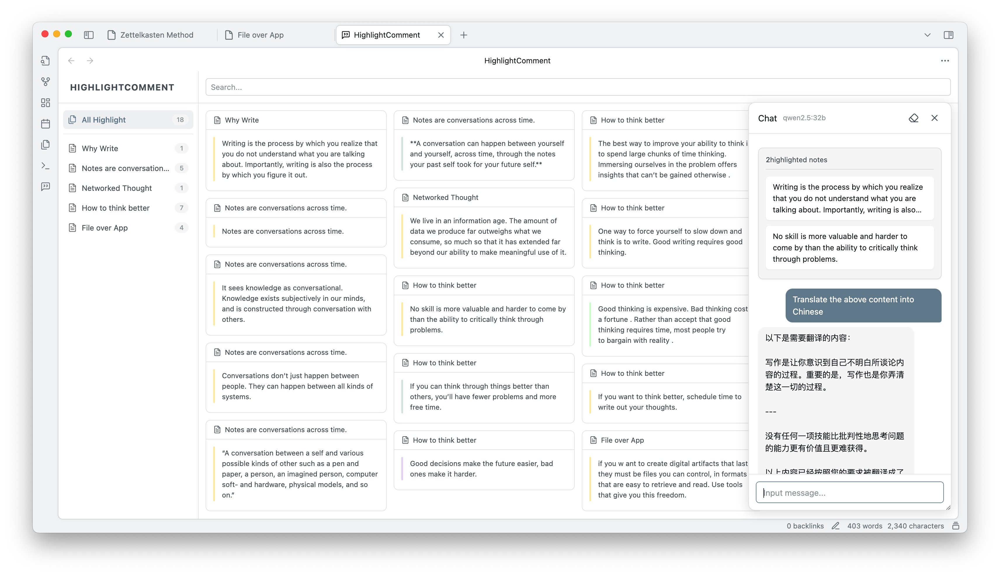

This AI-programmed Obsidian plugin can automatically extract highlighted text from notes, allowing users to add comments, generate AI comments, and engage in dialogue with the highlighted text. Users can highlight text in various formats, export it as knowledge card images, and enjoy additional extended features in the main view.

>  I have no development experience. This plugin was completed by me and an AI together. Please use it with caution as it is in the Beta version.

---
## Highlighted text retrieval

When you open a note with highlighted text, the sidebar automatically displays the highlighted text in card format. The following three formats of highlight tags are supported: `==`, `<mark>`, and ``.

---
## Highlighted comments

The highlight comment feature allows you to quickly engage with highlighted text, preventing your ideas from slipping away. Simply click on the Widgets in the editing area or directly click the add comment button on the card to open the input box.

>  All your highlight and comment data will be stored in the plugin's data.json file, giving you complete control.

GIF 

---
## Export as image

Export your highlighted text as beautifully designed knowledge cards for easy sharing.

---
## Extended features of the main view

Drag the right sidebar window to the main view to unlock more features, such as a list of notes with highlighted text, all highlighted cards, and the AI chat window (see below for details).

- Notes List: Displays all notes in the knowledge base that contain highlighted text, with the number of highlights indicated.
- All Highlights: Shows all highlighted cards in the knowledge base, allowing you to focus more on the highlighted content.
- AI Chat: You can open the AI chat window via the chat icon in the bottom right corner (see below for details).

---
## AI Comment

AI can assist you in thinking and add the generated content as a comment below the highlighted text. First, you need to configure the AI provider, API Key, and model in the plugin's settings menu. Currently supported providers include OpenAI, Gemini, Anthropic, and Ollama.

Next, configure your custom Prompt. Here, you can use two fields to obtain the highlighted text and comment content: `{{highlight}}` and `{{Comment}}` .

Finally, you can use your custom Prompt in the AI button on the highlighted card.

---
## AI Chat

In the bottom right corner of the main view, you can click the conversation icon or use the shortcut command (`Cmd+P`) to open the AI conversation window. This window can be freely dragged and resized. Within the conversation window, you can switch the AI service model and clear the current conversation content (note that once cleared, it cannot be restored, and exporting or saving is not supported at this time).

Additionally, you can drag highlighted cards into the conversation window as part of the dialogue, and it supports dragging in multiple highlighted items simultaneously.

---
## THANK YOU 🙏

If you like this plugin and want to say thanks, you can buy me a coffee here!
