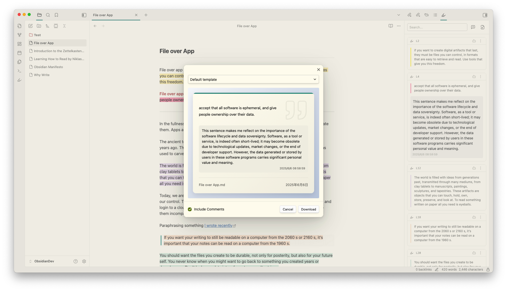
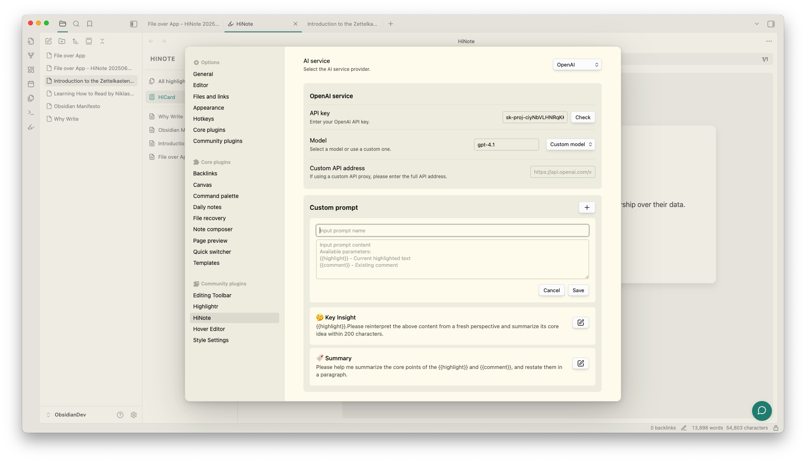
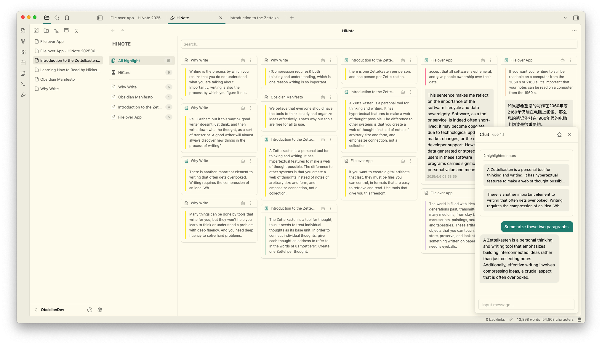
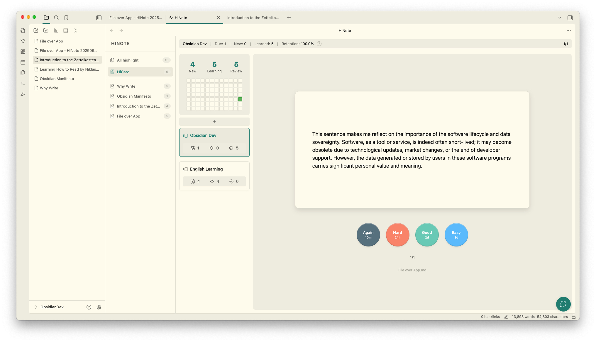
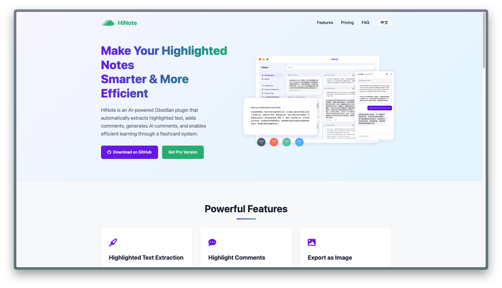

	<h1>HiNote - Highlight Text with Comments</h1>
	
	
	
	
	
	  
	

---

[简体中文](./README-ZH.md) | English

This AI-programmed Obsidian plugin can automatically extract highlighted text from notes, allowing users to add comments, generate AI comments, and engage in dialogue with the highlighted text. Users can highlight text in various formats, export it as knowledge card images or create new notes, while enjoying additional extended features in the main view.

> 💡 **Tip:** [Upgrade to Pro](https://hinote.vip) to unlock the FSRS-powered flashcard system for efficient memorization of your highlights

>  This plugin is developed with AI assistance and is currently in Beta testing. Please use it with caution and back up your data regularly.

👇🏻 Click the image to view the video tutorial

---

## Highlighted text retrieval

When you open a note with highlighted text, the sidebar automatically displays the highlighted text in card format. The following three formats of highlight tags are supported: `==`, `<mark>`, and ``. Custom formats can also be defined using regular expressions.

---

## ✨ Key Features

🎯 Auto-extract highlights in multiple formats | 📝 Add comments and notes to highlights | 🤖 AI-assisted comments and intelligent dialogue | 📸 Export as beautiful knowledge cards | 📝 Generate new notes linked to source | 🧠 Spaced repetition learning system (Pro)

---

## Highlighted comments

The highlight comment feature allows you to quickly engage with highlighted text, preventing your ideas from slipping away. Simply click on the Widgets in the editing area or directly click the add comment button on the card to open the input box.

The note comment feature allows you to add your thoughts to the entire document without relying on any highlighted text. Click the add file comment on the right side of the search bar to open the input box at the top of the highlight list.

>  All comments and highlight data are stored in the `.hinote` folder in the root directory of your vault, giving you complete control over your data.

---

## Export as image

Export your highlighted text and comments to create beautifully designed knowledge cards for easy sharing.

---

## Export as note

Export all your highlighted text and comments as a new note, displayed in Callout format. Each highlight and comment can be linked back to the source note through block references (Block ID).

---

## Extended features of the main view

Drag the right sidebar window to the main view to unlock more features, such as a list of notes with highlighted text, all highlighted cards, and the AI chat window (see below for details).

- Notes List: Displays all notes in the knowledge base that contain highlighted text, with the number of highlights indicated.
- All Highlights: Shows all highlighted cards in the knowledge base, allowing you to focus more on the highlighted content.
- AI Chat: You can open the AI chat window via the chat icon in the bottom right corner (see below for details).
- HiCard: Implements the functionality to generate FlashCards from your highlighted text and comments, assisting you in memorizing and learning (Pro feature)

---

## AI Comment

AI can assist you in thinking and add the generated content as a comment below the highlighted text.

First, you need to configure the AI provider, API Key, and model in the plugin's settings menu. Currently supported providers include OpenAI, Gemini, Anthropic, Deepseek, SiliconFlow, and Ollama.

Next, configure your custom Prompt. Here, you can use two fields to obtain the highlighted text and comment content: `{{highlight}}` and `{{comment}}`.

Finally, you can use your custom Prompt in the AI button on the highlighted card. Or you can input your custom Prompt in the comment input box and directly click the Tab key to trigger the AI service.

---

## AI Chat

In the bottom right corner of the main view, you can click the conversation icon or use the shortcut command (`Ctrl/Cmd+P`) to open the AI conversation window. This window can be freely dragged and resized. Within the conversation window, you can switch the AI service model and clear the current conversation content (note that once cleared, it cannot be restored, and exporting or saving is not supported at this time).

Additionally, you can drag highlighted cards into the conversation window as part of the dialogue, and it supports dragging in multiple highlighted items simultaneously. You can also set the context of the highlighted text in the conversation window.

---

## Pro Features

HiNote offers additional premium features that enhance your note-taking and learning experience:

### Flashcard System

The Flashcard feature is available in the Pro version of HiNote. This advanced spaced repetition system helps you memorize your highlighted content more effectively:

- Convert your highlights into flashcards with just one click
- Utilize the FSRS (Free Spaced Repetition Scheduler) algorithm for optimal learning efficiency
- Customize review schedules to match your learning style

To access these premium features, you'll need to [upgrade to Pro](https://hinote.vip).

---

## Support

If you find this plugin useful and would like to support its development:

- [Buy me a coffee on Ko-fi](https://ko-fi.com/catmuse)
- Give the project a ⭐ star to show your support!

---

## License

This plugin is released under the MIT License. The basic features are free and open-source, while some advanced features require a Pro license.
